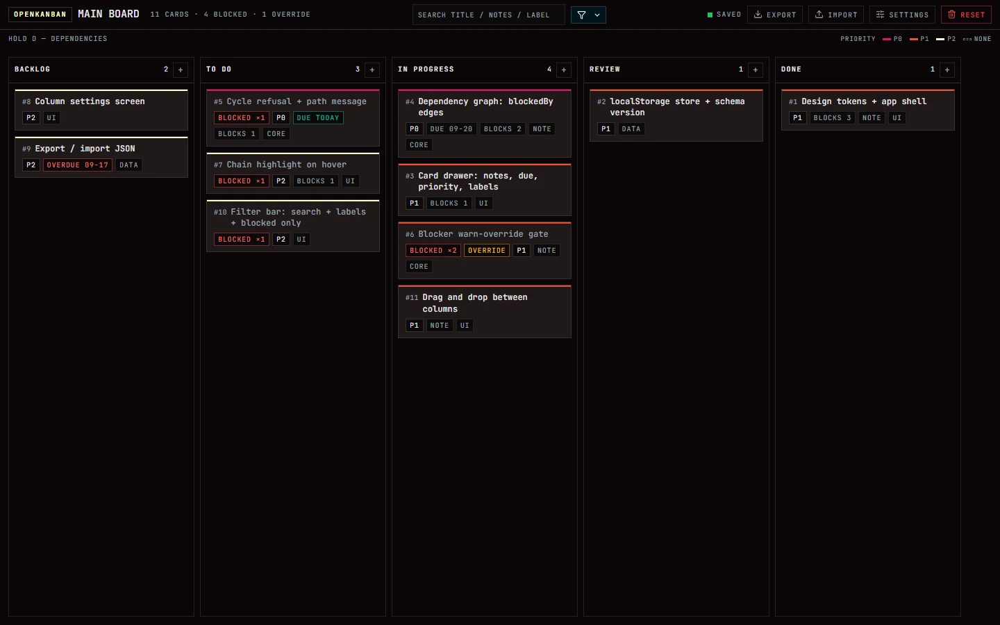
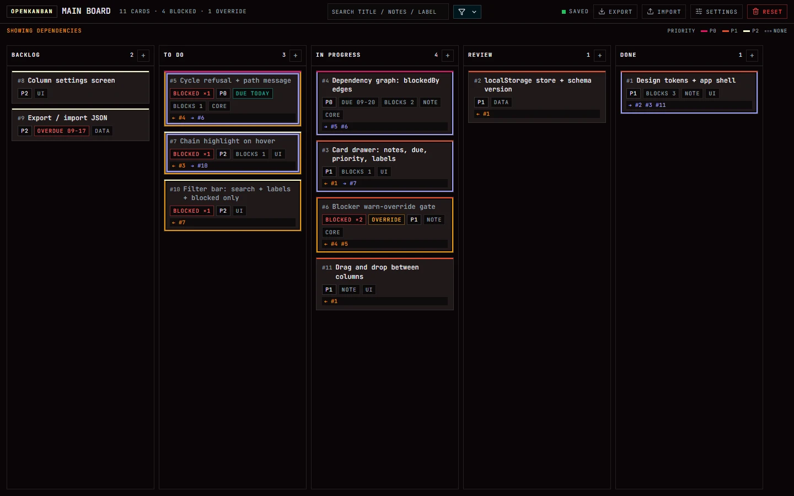
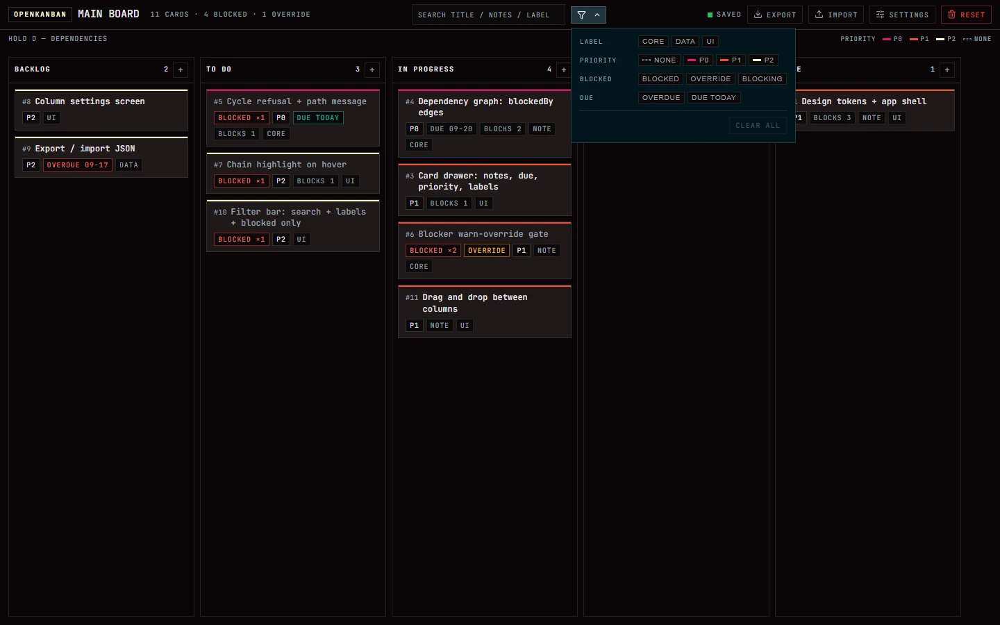
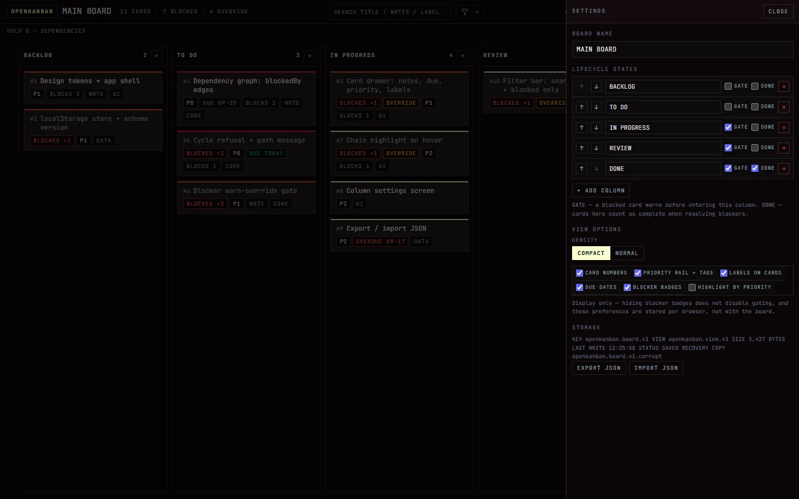
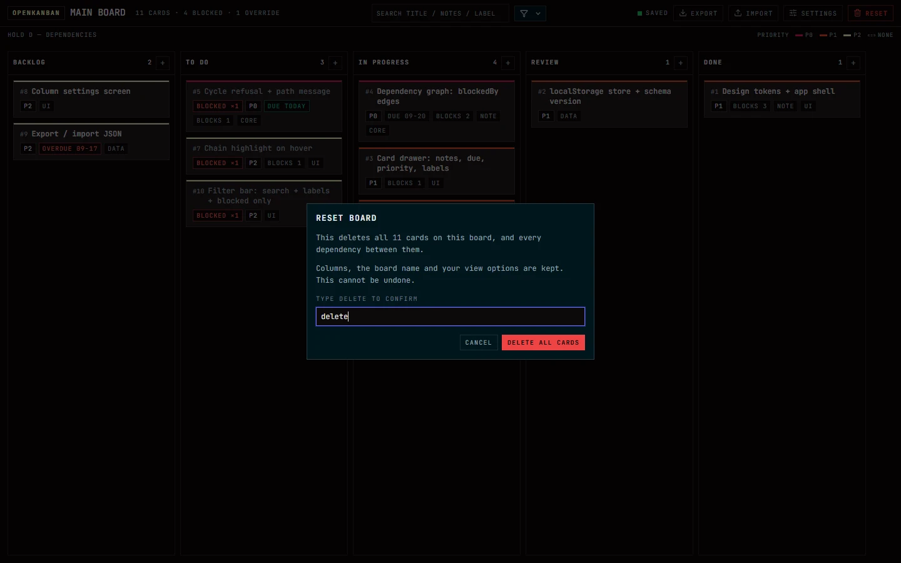
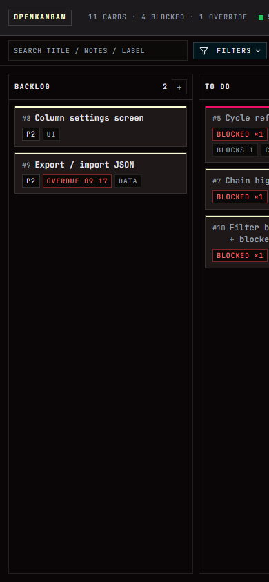

# OpenKanban

[](https://github.com/evanokeefe39/openkanban/actions/workflows/ci.yml)

A kanban board where dependencies are part of the data model: a card knows what blocks it, the board refuses to let you forget, and holding one key shows you the whole wiring.

I wanted a simple kanban with dependency tracking, could not find one in a few minutes of looking, and built this instead. The first working version took about an hour. It is three static files with no build step, no dependencies and no server, so it runs from a folder on your laptop exactly as it runs from a URL.



## Dependencies are the point

Most boards treat a dependency as a note you write in a card. Here it is an edge in a graph, and the board's state is computed from it:

- **Edges are stored, blocked state is derived.** A card lists what blocks it. Whether it *is* blocked is worked out from the graph every render, so the badge and the wiring can never disagree.
- **A card is blocked while any blocker sits outside a DONE column.** Retiring a blocker is what unblocks its dependents — there is no second thing to remember to tick.
- **Gated columns warn before they let you through.** Moving a blocked card into a gated column explains exactly what is still unfinished and records an override — visible as an `OVERRIDE` chip, derived from the graph rather than stored as a flag.
- **Cycles are refused at the point of adding the edge**, with the path that would close, rather than at some later render where the cause is gone.
- **Hold `D` to see the wiring.** Every card in the hovered card's chain grows a border, and the card itself shows a row of numbered references — `← #4` blocked by 4, `→ #6` blocks 6. A **red candy cane** marks what the hovered card blocks; a **solid white line**, inset a step inside it, marks what blocks it. A card that does both carries both, which is the one case you can read at a glance. Release and the board goes quiet again.



The graph is the reason the rest of the app is shaped the way it is. Card numbers exist so the wiring can be *spoken* ("4 blocks 6") instead of restated as titles, and they are handles rather than positions: assigned once, never reused.

## Everything else

- **Five lifecycle columns** by default, all editable: rename, reorder, add, delete, and flag each as a **gate** (warn on entry) or **done** (retiring work here unblocks dependents).
- **Cards** carry notes, priority (P0/P1/P2), due dates and labels, with an inline composer in each column.
- **Drag and drop** between and within columns — plus a `MOVE TO` row in the card drawer, which is the keyboard and touch path to the same `attemptMove` and therefore the same gate.
- **Search and filters** over title, notes and label, plus priority, blocked-only and due-date categories, with a live count of what is active.
- **View options** for density and six display toggles — card numbers, priority colour, labels, due dates, status chips, highlight-by-priority. They live in a separate storage key from the board, because they are a per-browser preference rather than part of the document.
- **Export and import** as JSON, with every repair itemised before anything is replaced.
- **Reset** — every card on the board, behind typing `delete` to arm the button. It is the one action with no undo, so it is the one action that makes you say the word.
- **A storage lamp** that says `SAVED` or explains why it could not, and quarantines an unreadable payload to `<key>.corrupt` instead of discarding it.
- **One file, one dependency: JetBrains Mono over a dark palette**, zero border radius, hard 1px rules, no shadows.

| Filters | Settings and view options |
| --- | --- |
|  |  |

| Reset, gated on a typed word | Narrow viewport |
| --- | --- |
|  |  |

## Running it

Open `index.html`. That is the whole story — the app is designed to work from `file://` as well as from a server.

If you would rather serve it (which is how it runs in CI):

```sh
npm run serve     # http://127.0.0.1:8080, no-cache
```

Use that rather than `python -m http.server`. Python's server sends `Last-Modified` with no `Cache-Control`, so Chromium applies heuristic freshness and will happily serve you the *previous* document after an edit — which looks exactly like a CSS bug and is not one. [`tools/serve.mjs`](tools/serve.mjs) sends `Cache-Control: no-store` and costs nothing to run. The whole story is in [`LEARNINGS.md`](LEARNINGS.md).

### Keyboard

| Key | Does |
| --- | --- |
| Hold `D` | Show the dependency overlay: borders plus `← #n` / `→ #n` references, shaded by direction |
| `C` | Add a card to the first column |
| Hold `Ctrl` | Reveal the card ticks. Click cards to pick them, then drag any one of them to move the group |
| `Enter` | Add the card you are composing (in the inline composer or the drawer's label/blocker fields) |
| `Escape` | Close the popover, a dialog, or a drawer |

The `MOVE TO` row in the card drawer is the keyboard path for moving a card, and it goes through the same gate as dragging. So does a group drag: a batch that contains blocked cards warns once, naming each of them, before it moves.

## Where your data lives

Two `localStorage` keys, deliberately separate:

| Key | Holds | Notes |
| --- | --- | --- |
| `openkanban.board.v1` | The document: name, columns, cards, edges, card numbers | What export writes and import replaces |
| `openkanban.board.v1.corrupt` | The payload that would not parse | Quarantined, never silently dropped |
| `openkanban.view.v1` | Density and the six display toggles | Per-browser preference; importing a board must not rewrite it |

A stored board is validated on load and repaired where it can be (a document saved without card numbers gets numbers in creation order, and says so). Anything unreadable is quarantined under `<key>.corrupt` and a fresh board is seeded, so a bad payload costs you a warning, not a silent wipe of the good copy.

## Tests and CI

The app has no build, so a green build would prove nothing. The gate drives the real page in a real browser instead — [`tests/smoke.mjs`](tests/smoke.mjs) serves the repo over http, opens it with Playwright, and checks the behaviour the app would be broken without:

- a cold start seeds the sample board; a corrupt payload is quarantined and replaced
- a card saved without numbers is repaired in creation order rather than quarantined
- adding a card numbers it and persists it
- a card with an unfinished blocker reads as blocked, a move into a gated column warns first, and confirming records an override while the card stays flagged
- a blocker that would close a cycle is refused at the point of adding it
- holding `D` shows the wiring and releasing clears it
- a filter chip filters the board, and the pane closes on Escape without losing the filters
- a view option hides its element and is stored outside the board document
- export produces a file that imports back to the same board
- reset only arms on the whole word, wipes every card, keeps the columns, and stays empty after a reload
- the page logged no errors while any of that happened

```sh
npm ci
npx playwright install chromium
npm test          # 31 checks, ~10s
npm run check     # syntax check, plus every var() in the CSS must resolve
```

`npm run check` also runs [`tests/check-styles.mjs`](tests/check-styles.mjs), which exists because of a real defect: deleting a CSS token leaves every `var(--that-token)` silently resolving to nothing — no console error, no failed check, just an element with no background. It cross-references every `var(--x)` use against the definitions and fails the build instead.

If the pinned browser download is unavailable (it can be, behind a proxy), any installed Chromium-family browser will do: `OK_BROWSER_CHANNEL=msedge npm test`.

[`.github/workflows/ci.yml`](.github/workflows/ci.yml) runs exactly that on every pull request and on every push to `main`, and uploads a screenshot of the failure to `tests/.artifacts/` when it fails. Playwright is the only dependency in the repo, and it is a dev dependency: the app itself has none.

## Deploying

Any static host works, because there is nothing to build. On Vercel: import the repository, leave the framework preset as **Other**, leave the build command empty, and let it serve the repository root. [`vercel.json`](vercel.json) adds the two things worth adding — `Cache-Control: max-age=0, must-revalidate` so a deploy takes effect on the next load instead of leaving someone on last week's markup, and `nosniff` / `no-referrer` / `DENY` frame headers.

## Roadmap

Undo/redo, multiple boards, and an `npx` package that puts a local server, a CLI and an MCP server in front of the same board so an agent can read and write it rather than only render it — plus what was considered and rejected, and why. See [`ROADMAP.md`](ROADMAP.md).

## Design notes

The look is lifted from a sibling project's design language: a dark instrument panel, JetBrains Mono throughout, 1px rules as the only source of separation, and zero border radius.

The board is two surfaces and one hover. The **page** (`#0a0608`) carries everything that is part of the board: the toolbar, the read-out row, the columns and the filter pane, so those are drawn by their 1px rules rather than by a change of plane. The **card** (`#1f1819`) is warm against it. Only genuinely floating chrome takes a third: **ink** (`#00161c`) for the modals and the toasts, which appear *over* the board rather than beside it. Every hover across the app is one translucent white lift rather than a fourth colour, so a button looks like the same button wherever it is placed.

Colour is rationed, and this is the rule that keeps it legible: **colour is reserved for the priority rail, the blocked/override/due chips, the filter badge, and the dependency overlay** — everything else is ivory or a grey. Where two colour systems have to share a surface (priority fills and dependency rings, for instance) they are separated by a dark step rather than a louder hue, because contrast for a coloured ring is set by what is immediately behind it. That is a measured decision, not a taste one: on the palest priority tint the dependency ring measured 1.28:1 before the fix and 4.5:1 or better after it, with ring rendering identical whether the fills are tinted or not.

The build's specification, verification log and the numbers behind claims like that live in [`tasks/plans/openkanban-mvp.md`](tasks/plans/openkanban-mvp.md).

## Repository layout

```
index.html                the document: board, drawers, dialogs
styles.css                all of the design language
app.js                    one IIFE: model, graph, render, storage
tests/smoke.mjs           the deploy gate, driven through a real browser
tests/check-styles.mjs    fails the build if a var() has no definition
tools/serve.mjs           the no-cache dev server
docs/screenshots/         the images in this README
tasks/plans/              specification, decisions and verification log
.github/workflows/ci.yml  runs the gate on every pull request
vercel.json               cache and security headers for the deploy
```

## Working on it

If you are changing the code rather than reading it, start with [`AGENTS.md`](AGENTS.md) — it carries the conventions, the one rule that shapes the data model, and the verification bar.

| Document | Purpose |
| --- | --- |
| [`AGENTS.md`](AGENTS.md) | How to work here: architecture, conventions, the commands, the verification bar |
| [`ROADMAP.md`](ROADMAP.md) | What is planned, and what was considered and rejected |
| [`ISSUES.md`](ISSUES.md) | Bugs found and fixed, and the limitations that remain |
| [`LEARNINGS.md`](LEARNINGS.md) | Mistakes already made here, so they are not made twice |
| [`WATCHDOG.md`](WATCHDOG.md) | Reviewer guidance: what to be suspicious of in this codebase |

## How this was built

One session, one model (`deepseek-v4-flash`), with the transcript as the source of these numbers — parsed with DuckDB out of the harness's session log, counting only the model's own responses (a "turn" is a message from me, and one turn can be dozens of responses once the agent starts running tools). Measured at the commit that last touched this section; the session ran on past it, so these are a snapshot rather than a final total.

The query, if you want to reproduce it against your own session log:

```sql
SELECT count(*) AS responses,
       sum(message.usage.input)::BIGINT  AS input_tokens,
       sum(message.usage.output)::BIGINT AS output_tokens,
       sum(message.usage.cacheRead)::BIGINT AS cache_reads,
       sum(message.usage.totalTokens)::BIGINT AS total_tokens,
       round(sum(message.usage.cost.total), 2) AS cost_usd
FROM read_json_auto('<session>.jsonl', format = 'newline_delimited', union_by_name = true)
WHERE type = 'message' AND message.role = 'assistant';
```

| | |
| --- | --- |
| Wall clock | 162 minutes |
| Turns (mine) | 24 |
| Model responses | 424 |
| Tool calls | 617 |
| Input tokens | 1,552,941 |
| Output tokens | 619,273 |
| Reasoning tokens | 292,540 |
| Cache reads | 78,054,272 |
| Total tokens | 80,226,486 |
| Cost | $1.68 |
| App code | 3,829 lines across `index.html`, `styles.css`, `app.js` |
| Test harness and config | 486 lines |

Roughly a cent a minute, and about four hundredths of a cent per line that survived to the end — of which the majority was spent on the parts you cannot see in a screenshot: the derived-blocked model, the validation and repair path, and measuring contrast rather than guessing at it.

## Licence

The code is licensed under the [PolyForm Noncommercial License 1.0.0](LICENSE.md). You are free to
read it, run it, learn from it, and use it for anything noncommercial — personal projects, study,
hobby work, teaching, research, and use by charities, schools and public bodies. Commercial use is
not permitted. That includes running it as a paid product, bundling it into something you sell, or
selling the development itself.

If you want to use it commercially, ask.
